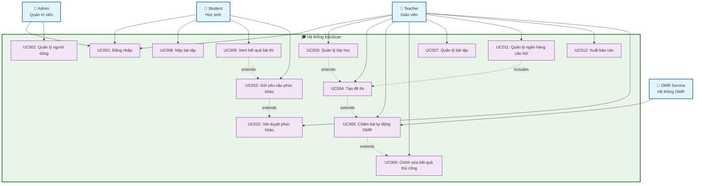

  
**ĐẠI HỌC BÁCH KHOA HÀ NỘI**

**TRƯỜNG CÔNG NGHỆ THÔNG TIN & TRUYỀN THÔNG**

Đặc tả Yêu cầu Phần mềm

*Phiên bản 1.0*

**EDUSCAN**

Hệ thống Quản lý Lớp học & Chấm bài Trắc nghiệm Tự động

Sinh viên: Nguyễn Phương Linh \- MSSV: 20224871

Đồ án 3 • Kỳ 2025.2  \-  GVHD: Phan Đăng Hải

# **1\. GIỚI THIỆU**

## **1.1 Mục tiêu**

Tài liệu này trình bày Đặc tả Yêu cầu Phần mềm (SRS) cho dự án EduScan. Mục đích là mô tả đầy đủ, rõ ràng và nhất quán các yêu cầu chức năng và phi chức năng của hệ thống, phục vụ cho nhóm phát triển, người kiểm thử, giảng viên hướng dẫn và các bên liên quan.

## **1.2 Phạm vi**

EduScan là hệ thống quản lý giáo dục tích hợp, hỗ trợ:

* Giáo viên tạo và quản lý lớp học, đề thi, chấm bài trắc nghiệm tự động qua OMR, quản lý bài tập, xuất báo cáo.

* Học sinh xem điểm chi tiết, nộp bài tập, gửi yêu cầu phúc khảo.

* Admin quản lý tài khoản người dùng và phân quyền toàn hệ thống.

Hệ thống chạy đa nền tảng: Web, iOS và Android thông qua React Native (Expo).

## **1.3 Bảng thuật ngữ**

| STT | Thuật ngữ | Giải thích | Ghi chú |
| :---: | ----- | ----- | ----- |
| 1 | OMR | Optical Mark Recognition – Nhận dạng ký hiệu quang học trên phiếu thi trắc nghiệm. |  |
| 2 | JWT | JSON Web Token – Token xác thực người dùng không trạng thái. |  |
| 3 | SRS | Software Requirements Specification – Đặc tả Yêu cầu Phần mềm. |  |
| 4 | Student ID | Số báo danh học sinh được nhận diện tự động từ vùng bubble grid hoặc barcode trên phiếu thi. |  |
| 5 | Batch | Xử lý hàng loạt – upload nhiều ảnh phiếu thi cùng lúc và xử lý bất đồng bộ. |  |
| 6 | Manual Override | Chỉnh sửa thủ công kết quả OMR bởi giáo viên khi hệ thống nhận diện sai. |  |
| 7 | Admin | Quản trị viên hệ thống – có quyền cao nhất, quản lý tài khoản và phân quyền. |  |
| 8 | Teacher (GV) | Giáo viên – tự quản lý lớp, đề thi, bài tập của mình. |  |
| 9 | Student (HS) | Học sinh – xem điểm, nộp bài tập, gửi phúc khảo. |  |

## **1.4 Tài liệu tham khảo**

* NestJS Documentation – https://docs.nestjs.com

* FastAPI Documentation – https://fastapi.tiangolo.com

* OpenCV Documentation – https://docs.opencv.org

* Prisma Documentation – https://www.prisma.io/docs

* Bull Queue Documentation – https://github.com/OptimalBits/bull

# **2\. MÔ TẢ TỔNG QUAN**

## **2.1 Khảo sát hệ thống**

EduScan hướng tới việc số hóa quy trình kiểm tra, chấm điểm và quản lý kết quả học tập trong môi trường giáo dục phổ thông và đại học. Thay vì chấm tay hoặc dùng máy chuyên dụng đắt tiền, giáo viên chỉ cần chụp ảnh phiếu thi bằng điện thoại và upload lên hệ thống. EduScan tự động nhận diện câu trả lời, khớp với đáp án chuẩn và lưu kết quả.

Các tác nhân chính của hệ thống:

* Giáo viên (Teacher): Quản lý lớp học, tạo đề thi, chấm bài tự động, quản lý bài tập, xem thống kê và xuất báo cáo.

* Học sinh (Student): Xem điểm, xem chi tiết bài làm, nộp bài tập, gửi phúc khảo.

* Quản trị viên (Admin): Quản lý tài khoản, phân quyền người dùng.

* Hệ thống OMR Service (FastAPI): Dịch vụ xử lý ảnh phiếu thi bằng OpenCV, nhận diện câu trả lời và Student ID.

## **2.2 Yêu cầu tổng quát**

Bảng 2.1 – Các module chức năng chính:

| STT | Module | Chức năng chính |
| :---: | ----- | ----- |
| 1 | **Auth** | Đăng nhập, phân quyền 3 role, quản lý JWT |
| 2 | **Quản lý lớp học** | Giáo viên tự tạo/quản lý lớp; thêm/xóa học sinh |
| 3 | **Bài kiểm tra** | Tạo đề thi, nhập đáp án chuẩn, gán lớp, xem kết quả |
| 4 | **OMR – Chấm tự động** | Nhận diện ảnh phiếu thi, Student ID, xử lý batch async |
| 5 | **Bài tập** | Tạo bài tập, nộp bài (kèm logic deadline/late), chấm điểm |
| 6 | **Dashboard học sinh** | Xem lịch sử điểm, chi tiết từng câu, biểu đồ tiến bộ |
| 7 | **Phúc khảo** | Học sinh gửi khiếu nại; giáo viên xét duyệt, cập nhật điểm |
| 8 | **Ngân hàng câu hỏi** | Lưu trữ, phân loại câu hỏi; tái sử dụng khi tạo đề thi |
| 9 | **Xuất báo cáo** | Xuất bảng điểm lớp ra Excel/PDF; báo cáo phân tích độ khó |
| 10 | **Quản lý người dùng** | Admin tạo/sửa/xóa tài khoản, gán role |

## **2.3 Quy trình nghiệp vụ**

Quy trình chấm bài tự động của EduScan diễn ra theo trình tự:

1. Giáo viên tạo đề thi và nhập đáp án chuẩn (Answer Key) hoặc chọn từ ngân hàng câu hỏi.

2. Học sinh làm bài trên phiếu thi giấy, tô bong bóng câu trả lời và vùng Student ID.

3. Giáo viên chụp ảnh phiếu thi và upload đơn lẻ hoặc theo batch lên hệ thống.

4. Hệ thống xử lý ảnh qua pipeline OMR: nhận diện Student ID → nhận diện câu trả lời → so đáp án → lưu kết quả.

5. Với batch, hệ thống xử lý bất đồng bộ và thông báo khi hoàn thành.

6. Giáo viên kiểm tra kết quả, chỉnh sửa thủ công nếu cần (Manual Override).

7. Học sinh xem điểm chi tiết, gửi phúc khảo nếu nghi ngờ chấm sai.

8. Giáo viên xét duyệt phúc khảo, xuất báo cáo điểm nếu cần.

# **3\. YÊU CẦU CHI TIẾT**

## **3.0 Biểu đồ Use Case tổng quan**

**Mô tả các tác nhân:**

- **Admin (Quản trị viên)**: Quản lý toàn bộ hệ thống, tạo và phân quyền tài khoản người dùng
- **Teacher (Giáo viên)**: Quản lý lớp học, tạo đề thi, chấm bài, quản lý bài tập và xuất báo cáo
- **Student (Học sinh)**: Xem điểm, nộp bài tập, gửi yêu cầu phúc khảo
- **OMR Service**: Hệ thống xử lý ảnh tự động để nhận diện câu trả lời trắc nghiệm

**Mối quan hệ chính:**
- Tất cả tác nhân đều phải đăng nhập (UC001)
- Giáo viên cần tạo lớp học trước khi tạo đề thi
- Chấm bài OMR có thể cần chỉnh sửa thủ công
- Học sinh có thể gửi phúc khảo sau khi xem kết quả

## **3.1 Use case UC001 – Đăng nhập**

• Đặc tả use case

| Use Case "Đăng nhập" 1\. Mã use case: UC001 2\. Mô tả tóm tắt: Use case mô tả tương tác giữa người dùng (Admin/Giáo viên/Học sinh) và hệ thống EduScan khi người dùng muốn đăng nhập để sử dụng các chức năng theo vai trò. 3\. Tác nhân: Người dùng (Admin, Giáo viên, Học sinh) 4\. Tiền điều kiện: Người dùng đã có tài khoản được cấp bởi Admin. Hệ thống đang hoạt động bình thường. 5\. Luồng cơ bản: Người dùng truy cập màn hình đăng nhập. Người dùng nhập email và mật khẩu. Hệ thống kiểm tra tính hợp lệ của thông tin đầu vào (không rỗng, đúng định dạng email). Hệ thống xác thực thông tin đăng nhập với database. Hệ thống cấp JWT access token và refresh token. Hệ thống lưu token vào secure storage trên thiết bị. Hệ thống điều hướng người dùng đến Dashboard tương ứng với vai trò. 6\. Luồng thay thế: Bảng 3.1.1 – Luồng thay thế UC001 STT Vị trí Điều kiện Hành động Tiếp tục 1 Bước 3 Trường email hoặc mật khẩu bỏ trống Hệ thống hiển thị thông báo lỗi bên cạnh trường bị lỗi. Quay lại Bước 2 2 Bước 4 Email không tồn tại hoặc mật khẩu sai Hệ thống hiển thị thông báo: "Email hoặc mật khẩu không đúng." Quay lại Bước 2 3 Bước 4 Tài khoản bị khóa bởi Admin Hệ thống hiển thị: "Tài khoản đã bị vô hiệu hóa. Liên hệ Admin." Use case kết thúc 7\. Dữ liệu đầu vào: Bảng 3.1.2 – Dữ liệu đầu vào UC001 STT Trường dữ liệu Mô tả Bắt buộc Ràng buộc Ví dụ 1 Email Địa chỉ email tài khoản Có Đúng định dạng email giaovien@truong.edu.vn 2 Mật khẩu Mật khẩu tài khoản Có Tối thiểu 8 ký tự •••••••• 8\. Dữ liệu đầu ra: Bảng 3.1.3 – Dữ liệu đầu ra UC001 STT Trường dữ liệu Mô tả Định dạng hiển thị Ví dụ 1 Access Token JWT dùng để xác thực các request tiếp theo Chuỗi ký tự eyJhbGc... 2 Refresh Token Token dùng để gia hạn access token Chuỗi ký tự eyJhbGc... 3 Thông tin người dùng Tên, email, vai trò JSON {name, email, role} 9\. Hậu điều kiện: Người dùng được xác thực thành công và chuyển đến Dashboard tương ứng. Token được lưu trữ an toàn trên thiết bị. |
| ----- |

## **3.2 Use case UC002 – Quản lý người dùng (Admin)**

• Đặc tả use case

| Use Case "Quản lý người dùng" 1\. Mã use case: UC002 2\. Mô tả tóm tắt: Use case mô tả việc Admin tạo, sửa, xóa tài khoản người dùng và gán vai trò (Admin/Giáo viên/Học sinh) trong hệ thống EduScan. 3\. Tác nhân: Admin 4\. Tiền điều kiện: Admin đã đăng nhập thành công. Hệ thống đang hoạt động bình thường. 5\. Luồng cơ bản (Tạo tài khoản): Admin chọn chức năng "Quản lý người dùng" trên Dashboard. Hệ thống hiển thị danh sách tất cả tài khoản hiện có. Admin chọn "Thêm người dùng mới". Admin nhập thông tin: Họ tên, Email, Mật khẩu tạm thời, Vai trò. Hệ thống kiểm tra tính hợp lệ của dữ liệu đầu vào. Hệ thống kiểm tra email chưa tồn tại trong database. Hệ thống tạo tài khoản mới với mật khẩu đã được mã hóa (bcrypt). Hệ thống hiển thị thông báo tạo tài khoản thành công. 6\. Luồng thay thế: Bảng 3.2.1 – Luồng thay thế UC002 STT Vị trí Điều kiện Hành động Tiếp tục 1 Bước 5 Trường thông tin bỏ trống hoặc sai định dạng Hệ thống hiển thị lỗi tại trường tương ứng. Quay lại Bước 4 2 Bước 6 Email đã tồn tại trong hệ thống Hệ thống hiển thị: "Email đã được sử dụng." Quay lại Bước 4 3 Bất kỳ bước nào Admin chọn Sửa tài khoản Hệ thống hiển thị form sửa; Admin chỉnh sửa và lưu. Use case kết thúc 4 Bất kỳ bước nào Admin chọn Xóa tài khoản Hệ thống yêu cầu xác nhận; nếu đồng ý, xóa tài khoản. Use case kết thúc 7\. Dữ liệu đầu vào: Bảng 3.2.2 – Dữ liệu đầu vào UC002 STT Trường dữ liệu Mô tả Bắt buộc Ràng buộc Ví dụ 1 Họ tên Tên đầy đủ người dùng Có Không rỗng Nguyễn Văn A 2 Email Email dùng để đăng nhập Có Đúng định dạng, chưa tồn tại gv.nguyen@truong.vn 3 Mật khẩu Mật khẩu ban đầu Có Tối thiểu 8 ký tự Pass@1234 4 Vai trò Admin / Teacher / Student Có Một trong 3 giá trị hợp lệ Teacher 8\. Dữ liệu đầu ra: Bảng 3.2.3 – Dữ liệu đầu ra UC002 STT Trường dữ liệu Mô tả Định dạng hiển thị Ví dụ 1 Thông báo Kết quả thao tác Text "Tạo tài khoản thành công\!" 2 Danh sách người dùng Danh sách cập nhật sau khi thêm/sửa/xóa Bảng dữ liệu ID, Tên, Email, Vai trò, Trạng thái 9\. Hậu điều kiện: Tài khoản mới được tạo và hiển thị trong danh sách. Người dùng có thể đăng nhập bằng email và mật khẩu vừa tạo. |
| ----- |

## **3.3 Use case UC003 – Quản lý lớp học (Giáo viên)**

• Đặc tả use case

| Use Case "Quản lý lớp học" 1\. Mã use case: UC003 2\. Mô tả tóm tắt: Use case mô tả việc Giáo viên tự tạo và quản lý lớp học của mình trên hệ thống EduScan, bao gồm tạo lớp, thêm/xóa học sinh và chia sẻ mã lớp. 3\. Tác nhân: Giáo viên (Teacher) 4\. Tiền điều kiện: Giáo viên đã đăng nhập thành công với vai trò Teacher. 5\. Luồng cơ bản: Giáo viên chọn "Tạo lớp mới" trên Dashboard. Giáo viên nhập thông tin lớp: tên lớp, môn học, năm học. Hệ thống tạo lớp học và sinh mã lớp (class code) duy nhất. Hệ thống hiển thị mã lớp để giáo viên chia sẻ với học sinh. Giáo viên chọn thêm học sinh vào lớp. Giáo viên tìm kiếm học sinh theo email hoặc nhập thủ công. Hệ thống xác nhận và thêm học sinh vào danh sách lớp. Hệ thống cập nhật danh sách thành viên lớp. 6\. Luồng thay thế: Bảng 3.3.1 – Luồng thay thế UC003 STT Vị trí Điều kiện Hành động Tiếp tục 1 Bước 2 Tên lớp bỏ trống Hệ thống hiển thị lỗi yêu cầu nhập tên lớp. Quay lại Bước 2 2 Bước 6 Không tìm thấy học sinh theo email Hệ thống thông báo "Không tìm thấy học sinh". Giáo viên thử lại. Quay lại Bước 6 3 Bước 6 Học sinh tự join bằng mã lớp Học sinh nhập mã lớp trong ứng dụng; hệ thống tự thêm vào lớp. Bước 8 4 Bất kỳ bước nào Giáo viên xóa học sinh khỏi lớp Hệ thống yêu cầu xác nhận; nếu đồng ý, xóa học sinh. Use case kết thúc 7\. Dữ liệu đầu vào: Bảng 3.3.2 – Dữ liệu đầu vào UC003 STT Trường dữ liệu Mô tả Bắt buộc Ràng buộc Ví dụ 1 Tên lớp Tên lớp học Có Không rỗng, tối đa 100 ký tự 12A1 \- Toán 2024 2 Môn học Tên môn học Có Không rỗng Toán học 3 Năm học Năm học áp dụng Có Định dạng YYYY-YYYY 2024-2025 4 Email học sinh Email của học sinh cần thêm Không Đúng định dạng email hs.nguyen@truong.vn 8\. Dữ liệu đầu ra: Bảng 3.3.3 – Dữ liệu đầu ra UC003 STT Trường dữ liệu Mô tả Định dạng hiển thị Ví dụ 1 Mã lớp Code để học sinh tự join Chuỗi 6 ký tự EDU-A1B2 2 Danh sách thành viên Học sinh hiện tại trong lớp Bảng: Tên, Email, SĐT Nguyễn Văn A, ... 3 Thông báo Kết quả thao tác Text "Thêm học sinh thành công\!" 9\. Hậu điều kiện: Lớp học được tạo thành công với danh sách học sinh đầy đủ. Học sinh có thể xem lớp trong ứng dụng. |
| ----- |

## **3.4 Use case UC004 – Tạo đề thi**

• Đặc tả use case

| Use Case "Tạo đề thi" 1\. Mã use case: UC004 2\. Mô tả tóm tắt: Use case mô tả việc Giáo viên tạo một đề thi mới trong hệ thống, bao gồm nhập thông tin đề, đáp án chuẩn và gán cho các lớp học. 3\. Tác nhân: Giáo viên (Teacher) 4\. Tiền điều kiện: Giáo viên đã đăng nhập. Giáo viên đã có ít nhất một lớp học. 5\. Luồng cơ bản: Giáo viên chọn "Tạo đề thi mới" trên Dashboard. Giáo viên nhập thông tin đề thi: tiêu đề, số câu hỏi, thang điểm. Giáo viên chọn phương thức nhập đáp án: nhập trực tiếp hoặc chọn từ ngân hàng câu hỏi. Giáo viên nhập/chọn đáp án chuẩn cho từng câu. Hệ thống kiểm tra đủ số câu theo cấu hình. Giáo viên chọn lớp áp dụng đề thi. Hệ thống lưu đề thi và Answer Key vào database. Hệ thống hiển thị xác nhận tạo đề thi thành công. 6\. Luồng thay thế: Bảng 3.4.1 – Luồng thay thế UC004 STT Vị trí Điều kiện Hành động Tiếp tục 1 Bước 2 Thông tin đề thi thiếu hoặc sai Hệ thống hiển thị lỗi yêu cầu hoàn thiện. Quay lại Bước 2 2 Bước 5 Số đáp án chưa đủ số câu Hệ thống hiển thị cảnh báo câu còn thiếu đáp án. Quay lại Bước 4 3 Bước 6 Giáo viên chưa có lớp nào Hệ thống nhắc giáo viên tạo lớp trước. Kết thúc use case 7\. Dữ liệu đầu vào: Bảng 3.4.2 – Dữ liệu đầu vào UC004 STT Trường dữ liệu Mô tả Bắt buộc Ràng buộc Ví dụ 1 Tiêu đề đề thi Tên bài kiểm tra Có Không rỗng Kiểm tra 1 tiết – Toán 12 2 Số câu hỏi Tổng số câu trong đề Có Số nguyên dương, tối đa 100 40 3 Thang điểm Điểm tối đa của bài thi Có Số thực dương 10 4 Đáp án chuẩn Đáp án đúng cho từng câu (A/B/C/D) Có Đủ số câu, mỗi câu 1 đáp án 1-A, 2-C, 3-B... 5 Lớp áp dụng Danh sách lớp sử dụng đề thi này Có Ít nhất 1 lớp 12A1, 12A2 8\. Dữ liệu đầu ra: Bảng 3.4.3 – Dữ liệu đầu ra UC004 STT Trường dữ liệu Mô tả Định dạng hiển thị Ví dụ 1 Mã đề thi ID định danh đề thi UUID exam-a1b2c3... 2 Answer Key Đáp án chuẩn đã lưu JSON Array \[{q:1,ans:'A'},{q:2,ans:'C'}...\] 3 Thông báo Kết quả tạo đề thi Text "Tạo đề thi thành công\!" 9\. Hậu điều kiện: Đề thi được lưu trong database kèm Answer Key. Đề thi xuất hiện trong danh sách bài kiểm tra của các lớp đã chọn. |
| ----- |

## **3.5 Use case UC005 – Chấm bài tự động qua OMR (Batch)**

• Đặc tả use case

| Use Case "Chấm bài tự động qua OMR" 1\. Mã use case: UC005 2\. Mô tả tóm tắt: Use case mô tả quá trình Giáo viên upload một hoặc nhiều ảnh phiếu thi để hệ thống tự động nhận diện câu trả lời qua pipeline OMR, nhận diện Student ID, so đáp án và lưu kết quả. Hỗ trợ xử lý batch bất đồng bộ. 3\. Tác nhân: 3.1 Giáo viên (Teacher) 3.2 OMR Service (FastAPI – hệ thống nội bộ) 4\. Tiền điều kiện: Giáo viên đã đăng nhập. Đề thi đã được tạo với Answer Key. Giáo viên có ảnh phiếu thi của học sinh. 5\. Luồng cơ bản: Giáo viên chọn đề thi và chọn "Upload ảnh phiếu thi". Giáo viên chọn một hoặc nhiều ảnh phiếu thi (JPEG/PNG). Hệ thống NestJS nhận file, lưu tạm lên Cloudinary. Hệ thống đẩy các job vào Bull Queue (Redis). Hệ thống trả về mã batch\_id và thông báo "Đang xử lý". Worker lấy job từ queue, gửi ảnh sang FastAPI OMR Service. OMR Service nhận diện vùng Student ID (bubble grid). OMR Service nhận diện câu trả lời bằng pixel counting. OMR Service trả JSON kết quả về NestJS. NestJS so đáp án với Answer Key, tính điểm. NestJS lưu Submission \+ SubmissionDetail vào database. Sau khi xử lý hết batch, hệ thống gửi thông báo cho Giáo viên. Giáo viên vào xem danh sách kết quả batch. 6\. Luồng thay thế: Bảng 3.5.1 – Luồng thay thế UC005 STT Vị trí Điều kiện Hành động Tiếp tục 1 Bước 7 Không nhận diện được Student ID Submission tạo với studentId=null, đánh dấu NEEDS\_REVIEW. Bước 8 2 Bước 8 Ảnh mờ hoặc chất lượng thấp OMR trả 422 image\_quality\_low; giáo viên được yêu cầu chụp lại. Use case kết thúc cho ảnh đó 3 Bước 8 Có câu tô 2 ô cùng lúc Câu đó đánh dấu NEEDS\_REVIEW; vẫn tiếp tục xử lý các câu khác. Bước 9 4 Bước 8 Số câu detect \< số câu đề Câu thiếu gán null, đánh dấu NEEDS\_REVIEW. Bước 9 5 Bước 4-11 Job trong queue thất bại 3 lần Hệ thống đánh dấu FAILED và thông báo giáo viên. Use case kết thúc 7\. Dữ liệu đầu vào: Bảng 3.5.2 – Dữ liệu đầu vào UC005 STT Trường dữ liệu Mô tả Bắt buộc Ràng buộc Ví dụ 1 File ảnh phiếu thi Ảnh phiếu thi cần chấm Có Định dạng JPEG/PNG; kích thước \< 10MB phieu\_01.jpg 2 Mã đề thi ID đề thi dùng để lấy Answer Key Có Tồn tại trong database exam-a1b2c3 8\. Dữ liệu đầu ra: Bảng 3.5.3 – Dữ liệu đầu ra UC005 STT Trường dữ liệu Mô tả Định dạng hiển thị Ví dụ 1 Student ID Số báo danh nhận diện từ phiếu Chuỗi số 20220038 2 Kết quả từng câu Đáp án học sinh \+ đúng/sai JSON Array \[{q:1,ans:'A',correct:true}...\] 3 Tổng điểm Điểm tính theo thang đề thi Số thực 8.5 4 Trạng thái GRADED / NEEDS\_REVIEW / FAILED Text NEEDS\_REVIEW 5 batch\_id Mã lô xử lý batch UUID batch-xyz123 9\. Hậu điều kiện: Kết quả chấm bài được lưu vào database. Giáo viên có thể xem danh sách kết quả và chỉnh sửa thủ công nếu có câu cần review. |
| ----- |

## **3.6 Use case UC006 – Chỉnh sửa kết quả thủ công (Manual Override)**

• Đặc tả use case

| Use Case "Chỉnh sửa kết quả thủ công" 1\. Mã use case: UC006 2\. Mô tả tóm tắt: Use case mô tả việc Giáo viên xem lại và chỉnh sửa thủ công kết quả OMR cho những câu hỏi bị đánh dấu NEEDS\_REVIEW hoặc khi giáo viên phát hiện kết quả không chính xác. 3\. Tác nhân: Giáo viên (Teacher) 4\. Tiền điều kiện: Giáo viên đã đăng nhập. Ít nhất một bài thi đã được chấm và có kết quả trong hệ thống. 5\. Luồng cơ bản: Giáo viên vào danh sách kết quả chấm bài của đề thi. Giáo viên chọn một bài thi cần kiểm tra (ưu tiên các bài có trạng thái NEEDS\_REVIEW). Hệ thống hiển thị giao diện song song: ảnh phiếu thi gốc (trái) và bảng kết quả OMR (phải). Giáo viên đối chiếu ảnh gốc với kết quả; xác định câu bị nhận diện sai. Giáo viên chọn câu cần sửa và thay đổi đáp án. Hệ thống cập nhật đáp án và tính lại tổng điểm. Hệ thống cập nhật trạng thái bài thi thành GRADED. Hệ thống hiển thị xác nhận cập nhật thành công. 6\. Luồng thay thế: Bảng 3.6.1 – Luồng thay thế UC006 STT Vị trí Điều kiện Hành động Tiếp tục 1 Bước 5 Giáo viên không thay đổi gì Hệ thống cho phép thoát mà không lưu thay đổi. Use case kết thúc 2 Bước 5 Giáo viên cần ghép Student ID thủ công Hệ thống hiển thị dropdown danh sách HS trong lớp để chọn. Bước 6 7\. Dữ liệu đầu vào: Bảng 3.6.2 – Dữ liệu đầu vào UC006 STT Trường dữ liệu Mô tả Bắt buộc Ràng buộc Ví dụ 1 Submission ID Mã bài thi cần chỉnh sửa Có Tồn tại trong database sub-abc123 2 Số câu cần sửa Thứ tự câu hỏi Có Số nguyên 1 đến số câu đề 5 3 Đáp án mới Đáp án chính xác theo giáo viên Có Một trong A/B/C/D hoặc null B 4 Student ID (nếu cần) Số báo danh học sinh Không Tồn tại trong lớp 20220038 8\. Dữ liệu đầu ra: Bảng 3.6.3 – Dữ liệu đầu ra UC006 STT Trường dữ liệu Mô tả Định dạng hiển thị Ví dụ 1 Kết quả cập nhật Danh sách câu sau khi chỉnh sửa Bảng Câu 5: B (Đúng) 2 Điểm mới Tổng điểm sau khi tính lại Số thực 9.0 3 Trạng thái Trạng thái bài thi sau sửa Text GRADED 4 Thông báo Kết quả lưu thay đổi Text "Cập nhật thành công\!" 9\. Hậu điều kiện: Kết quả OMR đã được cập nhật theo phán quyết của giáo viên. Điểm học sinh được tính lại chính xác. |
| ----- |

## 

## **3.7 Use case UC007 – Quản lý bài tập**

• Đặc tả use case

| Use Case "Quản lý bài tập" 1\. Mã use case: UC007 2\. Mô tả tóm tắt: Use case mô tả việc Giáo viên tạo bài tập giao cho lớp, thiết lập deadline và tùy chọn cho phép nộp muộn; đồng thời mô tả việc xem danh sách nộp bài và chấm điểm. 3\. Tác nhân: Giáo viên (Teacher) 4\. Tiền điều kiện: Giáo viên đã đăng nhập và có ít nhất một lớp học. 5\. Luồng cơ bản: Giáo viên chọn "Tạo bài tập mới". Giáo viên nhập thông tin bài tập: tiêu đề, mô tả, deadline, lớp áp dụng. Giáo viên cấu hình tùy chọn nộp muộn: cho phép hay không, mức trừ điểm nếu có. Hệ thống kiểm tra tính hợp lệ (deadline phải sau thời điểm hiện tại). Hệ thống tạo bài tập và thông báo cho học sinh trong lớp. Khi deadline đến, hệ thống tự động khóa/ghi nhận trạng thái nộp muộn. Giáo viên xem danh sách bài nộp, tải file, chấm điểm và ghi phản hồi. Hệ thống lưu điểm và phản hồi; học sinh nhận thông báo. 6\. Luồng thay thế: Bảng 3.7.1 – Luồng thay thế UC007 STT Vị trí Điều kiện Hành động Tiếp tục 1 Bước 4 Deadline đặt trước thời điểm hiện tại Hệ thống báo lỗi yêu cầu chọn deadline hợp lệ. Quay lại Bước 2 2 Bước 7 Không có học sinh nào nộp bài Giáo viên thấy danh sách trống; có thể gửi nhắc nhở. Use case kết thúc 7\. Dữ liệu đầu vào: Bảng 3.7.2 – Dữ liệu đầu vào UC007 STT Trường dữ liệu Mô tả Bắt buộc Ràng buộc Ví dụ 1 Tiêu đề bài tập Tên bài tập Có Không rỗng Bài tập tuần 5 – Hàm số 2 Mô tả Hướng dẫn làm bài Không Tối đa 2000 ký tự Giải các bài tập... 3 Deadline Hạn chót nộp bài Có Phải sau thời điểm tạo 25/06/2025 23:59 4 Cho phép nộp muộn Bật/tắt nộp muộn Không true/false true 5 Phần trăm trừ điểm Trừ điểm khi nộp muộn Không 0-100% 20 6 Lớp áp dụng Lớp nhận bài tập Có Ít nhất 1 lớp 12A1 7 Điểm Điểm chấm cho bài nộp Có (khi chấm) 0 đến thang điểm 8.5 8 Phản hồi Nhận xét của giáo viên Không Tối đa 1000 ký tự Bài làm tốt... 8\. Dữ liệu đầu ra: Bảng 3.7.3 – Dữ liệu đầu ra UC007 STT Trường dữ liệu Mô tả Định dạng hiển thị Ví dụ 1 Thông báo học sinh Thông báo có bài tập mới Push notification "Bài tập mới: Tuần 5" 2 Danh sách nộp bài Học sinh đã nộp \+ trạng thái Bảng Tên HS, File, ON\_TIME/LATE 3 Điểm và phản hồi Kết quả chấm gửi học sinh Text \+ số Điểm: 8.5; "Bài làm tốt" 9\. Hậu điều kiện: Bài tập được tạo và giao cho lớp. Sau khi chấm, điểm và phản hồi được lưu và học sinh nhận thông báo. |
| ----- |

## **3.8 Use case UC008 – Nộp bài tập (Học sinh)**

• Đặc tả use case

| Use Case "Nộp bài tập" 1\. Mã use case: UC008 2\. Mô tả tóm tắt: Use case mô tả tương tác của Học sinh khi nộp file bài tập lên hệ thống, bao gồm logic xử lý nộp đúng hạn và nộp muộn. 3\. Tác nhân: Học sinh (Student) 4\. Tiền điều kiện: Học sinh đã đăng nhập. Bài tập đã được giáo viên tạo và giao cho lớp học sinh. 5\. Luồng cơ bản: Học sinh vào màn hình danh sách bài tập. Học sinh chọn bài tập cần nộp. Hệ thống kiểm tra trạng thái deadline của bài tập. Hệ thống hiển thị form nộp bài kèm đồng hồ đếm ngược đến deadline. Học sinh chọn file cần nộp. Hệ thống kiểm tra định dạng và kích thước file. Hệ thống upload file lên Cloudinary. Hệ thống tạo bản ghi AssignmentSubmit với trạng thái ON\_TIME. Hệ thống hiển thị xác nhận nộp bài thành công. 6\. Luồng thay thế: Bảng 3.8.1 – Luồng thay thế UC008 STT Vị trí Điều kiện Hành động Tiếp tục 1 Bước 3 Đã quá deadline và không cho phép nộp muộn Hiển thị: "Đã hết hạn nộp bài". Nút nộp bị vô hiệu hóa. Use case kết thúc 2 Bước 3 Đã quá deadline nhưng cho phép nộp muộn Hiển thị cảnh báo: "Nộp muộn – có thể bị trừ điểm". Vẫn cho nộp. Bước 4 (bình thường) 3 Bước 6 File không đúng định dạng hoặc quá lớn Hệ thống hiển thị lỗi; yêu cầu chọn file khác. Quay lại Bước 5 4 Bước 7 Upload thất bại (lỗi mạng) Hệ thống hiển thị lỗi và cho phép thử lại. Quay lại Bước 7 5 Bước 8 Nộp sau deadline (cho phép nộp muộn) Trạng thái \= LATE; điểm có thể bị trừ theo cấu hình. Bước 9 7\. Dữ liệu đầu vào: Bảng 3.8.2 – Dữ liệu đầu vào UC008 STT Trường dữ liệu Mô tả Bắt buộc Ràng buộc Ví dụ 1 File bài tập File cần nộp Có PDF/DOC/DOCX/ZIP, tối đa 50MB baitap\_nguyenvana.pdf 2 Assignment ID Mã bài tập cần nộp Có Tồn tại và học sinh trong lớp assign-xyz456 8\. Dữ liệu đầu ra: Bảng 3.8.3 – Dữ liệu đầu ra UC008 STT Trường dữ liệu Mô tả Định dạng hiển thị Ví dụ 1 URL file Đường dẫn file đã upload URL https://cloudinary.com/... 2 Trạng thái nộp ON\_TIME hoặc LATE Text ON\_TIME 3 Thời gian nộp Dấu thời gian nộp bài dd/MM/yyyy HH:mm 25/06/2025 21:30 4 Thông báo Xác nhận nộp bài Text "Nộp bài thành công\!" 9\. Hậu điều kiện: Bài tập được lưu vào database với đầy đủ thông tin. Giáo viên nhận thông báo có bài nộp mới. |
| ----- |

## **3.9 Use case UC009 – Xem kết quả bài thi (Học sinh)**

• Đặc tả use case

| Use Case "Xem kết quả bài thi" 1\. Mã use case: UC009 2\. Mô tả tóm tắt: Use case mô tả việc Học sinh xem lịch sử điểm, chi tiết từng câu đúng/sai và biểu đồ tiến bộ của bản thân trên Dashboard cá nhân. 3\. Tác nhân: Học sinh (Student) 4\. Tiền điều kiện: Học sinh đã đăng nhập. Học sinh đã có ít nhất một bài thi đã được chấm. 5\. Luồng cơ bản: Học sinh vào Dashboard cá nhân. Hệ thống hiển thị danh sách tất cả bài thi đã có kết quả, sắp xếp theo thời gian mới nhất. Học sinh chọn một bài thi để xem chi tiết. Hệ thống hiển thị chi tiết: điểm tổng, từng câu đúng/sai, đáp án học sinh vs đáp án đúng. Hệ thống hiển thị ảnh phiếu thi gốc để học sinh đối chiếu. Học sinh xem biểu đồ điểm theo thời gian (line chart). 6\. Luồng thay thế: Bảng 3.9.1 – Luồng thay thế UC009 STT Vị trí Điều kiện Hành động Tiếp tục 1 Bước 2 Chưa có bài thi nào được chấm Hệ thống hiển thị trang trống kèm thông báo hướng dẫn. Use case kết thúc 2 Bước 4 Bài thi đang ở trạng thái NEEDS\_REVIEW Kết quả hiển thị nhưng có chú thích chờ giáo viên xác nhận. Bước 5 7\. Dữ liệu đầu vào: Bảng 3.9.2 – Dữ liệu đầu vào UC009 STT Trường dữ liệu Mô tả Bắt buộc Ràng buộc Ví dụ 1 Submission ID Mã bài thi cần xem chi tiết Có (khi chọn) Tồn tại và thuộc về học sinh sub-abc123 8\. Dữ liệu đầu ra: Bảng 3.9.3 – Dữ liệu đầu ra UC009 STT Trường dữ liệu Mô tả Định dạng hiển thị Ví dụ 1 Điểm tổng Tổng điểm bài thi Số thực / thang điểm 8.5 / 10 2 Chi tiết từng câu Đáp án HS, đáp án đúng, đúng/sai Bảng Câu 1: A (Đúng) | Câu 2: B → C (Sai) 3 Ảnh phiếu thi gốc Ảnh chụp phiếu thi Hình ảnh URL Cloudinary 4 Biểu đồ điểm Điểm theo thời gian Line chart Trục X: ngày, Trục Y: điểm 9\. Hậu điều kiện: Học sinh đã xem được kết quả chi tiết bài thi và biểu đồ tiến bộ. |
| ----- |

## **3.10 Use case UC010 – Gửi yêu cầu phúc khảo (Học sinh)**

• Đặc tả use case

| Use Case "Gửi yêu cầu phúc khảo" 1\. Mã use case: UC010 2\. Mô tả tóm tắt: Use case mô tả việc Học sinh gửi yêu cầu phúc khảo khi nghi ngờ hệ thống OMR chấm sai một câu hỏi. Giáo viên nhận được yêu cầu, xem xét và ra quyết định chấp thuận hoặc từ chối. 3\. Tác nhân: 3.1 Học sinh (Student) 3.2 Giáo viên (Teacher) 4\. Tiền điều kiện: Học sinh đã đăng nhập. Bài thi đã được chấm với trạng thái GRADED. Học sinh đang xem chi tiết bài thi. 5\. Luồng cơ bản: Học sinh xem chi tiết bài thi, phát hiện câu nghi ngờ bị chấm sai. Học sinh nhấn nút "Gửi khiếu nại" bên cạnh câu cần phúc khảo. Học sinh nhập lý do khiếu nại. Hệ thống tạo RemarkRequest với trạng thái PENDING. Hệ thống gửi thông báo cho Giáo viên về yêu cầu phúc khảo. Giáo viên vào danh sách yêu cầu phúc khảo. Giáo viên xem ảnh phiếu gốc phóng to cạnh kết quả OMR của câu đó. Giáo viên ra quyết định: Chấp thuận hoặc Từ chối. Nếu Chấp thuận: hệ thống cập nhật đáp án, tính lại điểm, trạng thái \= APPROVED. Nếu Từ chối: trạng thái \= REJECTED kèm lý do. Hệ thống gửi thông báo kết quả cho Học sinh. 6\. Luồng thay thế: Bảng 3.10.1 – Luồng thay thế UC010 STT Vị trí Điều kiện Hành động Tiếp tục 1 Bước 3 Học sinh không nhập lý do Hệ thống yêu cầu nhập lý do (bắt buộc). Quay lại Bước 3 2 Bước 2 Học sinh đã gửi phúc khảo câu này rồi Hệ thống thông báo: "Đã có yêu cầu phúc khảo đang xử lý." Use case kết thúc 7\. Dữ liệu đầu vào: Bảng 3.10.2 – Dữ liệu đầu vào UC010 STT Trường dữ liệu Mô tả Bắt buộc Ràng buộc Ví dụ 1 SubmissionDetail ID Câu hỏi cụ thể cần phúc khảo Có Tồn tại và thuộc bài thi của HS detail-abc123 2 Lý do khiếu nại Giải thích của học sinh Có Không rỗng, tối đa 500 ký tự Ảnh tôi tô rõ câu B nhưng... 3 Quyết định GV Chấp thuận / Từ chối Có (GV) APPROVED hoặc REJECTED APPROVED 4 Lý do từ chối (GV) Giải thích từ chối Khi từ chối Không rỗng Ảnh tô không đủ đậm 8\. Dữ liệu đầu ra: Bảng 3.10.3 – Dữ liệu đầu ra UC010 STT Trường dữ liệu Mô tả Định dạng hiển thị Ví dụ 1 Trạng thái phúc khảo Kết quả xét duyệt Text APPROVED / REJECTED 2 Điểm mới (nếu approved) Điểm sau khi cập nhật Số thực 9.0 3 Thông báo học sinh Kết quả phúc khảo Push notification "Phúc khảo câu 5: Được chấp thuận" 9\. Hậu điều kiện: Nếu chấp thuận: điểm học sinh được cập nhật chính xác. Nếu từ chối: điểm giữ nguyên. Cả hai trường hợp học sinh đều nhận thông báo kết quả. |
| ----- |

## **3.11 Use case UC011 – Quản lý ngân hàng câu hỏi**

• Đặc tả use case

| Use Case "Quản lý ngân hàng câu hỏi" 1\. Mã use case: UC011 2\. Mô tả tóm tắt: Use case mô tả việc Giáo viên tạo và quản lý kho câu hỏi trắc nghiệm cá nhân, phân loại theo môn/chương/độ khó và tái sử dụng khi tạo đề thi. 3\. Tác nhân: Giáo viên (Teacher) 4\. Tiền điều kiện: Giáo viên đã đăng nhập với vai trò Teacher. 5\. Luồng cơ bản (Thêm câu hỏi): Giáo viên vào mục "Ngân hàng câu hỏi". Giáo viên chọn "Thêm câu hỏi mới". Giáo viên nhập nội dung câu hỏi, 4 đáp án (A/B/C/D), đáp án đúng, phân loại. Hệ thống kiểm tra dữ liệu hợp lệ. Hệ thống lưu câu hỏi vào ngân hàng. Hệ thống hiển thị xác nhận thêm thành công. 6\. Luồng thay thế: Bảng 3.11.1 – Luồng thay thế UC011 STT Vị trí Điều kiện Hành động Tiếp tục 1 Bước 4 Thiếu nội dung câu hỏi hoặc đáp án Hệ thống báo lỗi tại trường thiếu. Quay lại Bước 3 2 Bất kỳ Giáo viên sửa câu hỏi Hệ thống hiển thị form sửa; lưu lại sau khi xác nhận. Use case kết thúc 3 Bất kỳ Giáo viên xóa câu hỏi Hệ thống xác nhận và xóa; cập nhật danh sách. Use case kết thúc 7\. Dữ liệu đầu vào: Bảng 3.11.2 – Dữ liệu đầu vào UC011 STT Trường dữ liệu Mô tả Bắt buộc Ràng buộc Ví dụ 1 Nội dung câu hỏi Đề câu hỏi Có Không rỗng Giới hạn của hàm số f(x) khi x→0 là? 2 Đáp án A Phương án A Có Không rỗng 0 3 Đáp án B Phương án B Có Không rỗng 1 4 Đáp án C Phương án C Có Không rỗng ∞ 5 Đáp án D Phương án D Có Không rỗng Không xác định 6 Đáp án đúng Đáp án chính xác Có Một trong A/B/C/D B 7 Môn học Môn học liên quan Có Không rỗng Toán học 8 Độ khó Mức độ câu hỏi Có EASY/MEDIUM/HARD MEDIUM 9 Tags Từ khóa phân loại Không Chuỗi phân cách dấu phẩy Giới hạn, Chương 1 8\. Dữ liệu đầu ra: Bảng 3.11.3 – Dữ liệu đầu ra UC011 STT Trường dữ liệu Mô tả Định dạng hiển thị Ví dụ 1 Question ID Mã câu hỏi đã lưu UUID q-abc123 2 Danh sách câu hỏi Ngân hàng câu hỏi cập nhật Bảng ID, Nội dung, Độ khó, Tag 3 Thông báo Kết quả thao tác Text "Thêm câu hỏi thành công\!" 9\. Hậu điều kiện: Câu hỏi được lưu vào ngân hàng và có thể được sử dụng khi tạo đề thi mới. |
| ----- |

## **3.12 Use case UC012 – Xuất báo cáo**

• Đặc tả use case

| Use Case "Xuất báo cáo" 1\. Mã use case: UC012 2\. Mô tả tóm tắt: Use case mô tả việc Giáo viên xuất bảng điểm lớp học ra file Excel hoặc PDF để sử dụng bên ngoài hệ thống (nộp cho nhà trường, lưu trữ...). 3\. Tác nhân: Giáo viên (Teacher) 4\. Tiền điều kiện: Giáo viên đã đăng nhập. Lớp học đã có ít nhất một bài thi được chấm. 5\. Luồng cơ bản: Giáo viên vào trang kết quả của lớp học. Giáo viên chọn "Xuất báo cáo". Giáo viên chọn định dạng file: Excel (.xlsx) hoặc PDF. Giáo viên tùy chọn phạm vi: tất cả bài thi hoặc một bài thi cụ thể. Hệ thống truy vấn dữ liệu điểm từ database. Hệ thống tạo file theo định dạng đã chọn. Hệ thống trả file về cho giáo viên tải xuống. 6\. Luồng thay thế: Bảng 3.12.1 – Luồng thay thế UC012 STT Vị trí Điều kiện Hành động Tiếp tục 1 Bước 5 Không có dữ liệu điểm nào Hệ thống thông báo: "Không có dữ liệu để xuất." Use case kết thúc 2 Bước 6 Tạo file thất bại (lỗi server) Hệ thống hiển thị lỗi 500; đề nghị thử lại. Quay lại Bước 3 7\. Dữ liệu đầu vào: Bảng 3.12.2 – Dữ liệu đầu vào UC012 STT Trường dữ liệu Mô tả Bắt buộc Ràng buộc Ví dụ 1 Class ID Mã lớp học cần xuất báo cáo Có Tồn tại và thuộc về GV class-xyz123 2 Định dạng file Excel hoặc PDF Có xlsx hoặc pdf xlsx 3 Phạm vi báo cáo Tất cả bài thi hoặc một đề cụ thể Không all hoặc exam ID all 8\. Dữ liệu đầu ra: Bảng 3.12.3 – Dữ liệu đầu ra UC012 STT Trường dữ liệu Mô tả Định dạng hiển thị Ví dụ 1 File báo cáo File Excel hoặc PDF bảng điểm Binary download bangdiem\_12A1\_2025.xlsx 2 Nội dung file STT, Tên HS, Điểm từng bài, TB Bảng dữ liệu 1, Nguyễn A, 8.5, 9.0, 8.75 9\. Hậu điều kiện: Giáo viên nhận được file báo cáo trên thiết bị và có thể sử dụng bên ngoài hệ thống EduScan. |
| ----- |

# **4\. ĐẶC TẢ BỔ SUNG**

## **4.1 Chức năng**

* Hệ thống tích hợp pipeline OMR sử dụng OpenCV để nhận diện câu trả lời trắc nghiệm từ ảnh chụp phiếu thi.

* Nhận diện tự động Số báo danh (Student ID) từ vùng bubble grid hoặc barcode trên phiếu thi.

* Xử lý batch bất đồng bộ thông qua Bull Queue (Redis): giáo viên upload nhiều ảnh, hệ thống xử lý nền và thông báo khi hoàn thành.

* Hệ thống hỗ trợ 3 role độc lập với phân quyền rõ ràng: Admin, Teacher, Student.

* Xuất báo cáo bảng điểm ra định dạng Excel (.xlsx) và PDF.

## **4.2 Khả năng sử dụng**

* Giao diện trực quan, thân thiện với người mới sử dụng công nghệ.

* Hỗ trợ đa nền tảng: Web, iOS và Android từ cùng một codebase React Native (Expo).

* Thông báo push real-time khi batch OMR hoàn thành, khi có bài nộp mới, khi có kết quả phúc khảo.

## **4.3 Độ tin cậy**

* Hệ thống hoạt động liên tục 99% uptime trong môi trường phát triển/demo.

* Bull Queue tự động retry tối đa 3 lần với exponential backoff khi job OMR thất bại.

* Graceful error handling: mọi lỗi API đều trả về mã HTTP và message rõ ràng.

## **4.4 Hiệu năng**

* API thông thường: response time \< 500ms trong điều kiện bình thường.

* OMR đơn lẻ: xử lý \< 10 giây/ảnh.

* OMR batch 40 ảnh: hoàn thành trong \< 5 phút (xử lý bất đồng bộ, không block UI).

* Hệ thống phục vụ đồng thời nhiều giáo viên upload batch mà không ảnh hưởng hiệu năng nhau.

## **4.5 Khả năng hỗ trợ**

* Kiến trúc module NestJS cho phép thêm tính năng mới mà không ảnh hưởng core.

* OMR Service FastAPI chạy độc lập, có thể scale riêng khi tải tăng.

* Schema database Prisma có migration rõ ràng, dễ nâng cấp cấu trúc dữ liệu.

## **4.6 Yêu cầu khác**

* Bảo mật: JWT access token có thời hạn 15 phút; refresh token 7 ngày; mật khẩu mã hóa bcrypt.

* Dữ liệu: SubmissionDetail lưu từng câu dạng relational (không chỉ JSON blob) để hỗ trợ SQL analytics phức tạp (% sai từng câu, thống kê độ khó).

* Lưu trữ file: ảnh phiếu thi và file bài tập lưu trên Cloudinary (free tier 25GB).

* Tuân thủ nguyên tắc: Giáo viên chỉ truy cập dữ liệu lớp học của mình; học sinh chỉ xem điểm của bản thân.

*— Kết thúc tài liệu—*